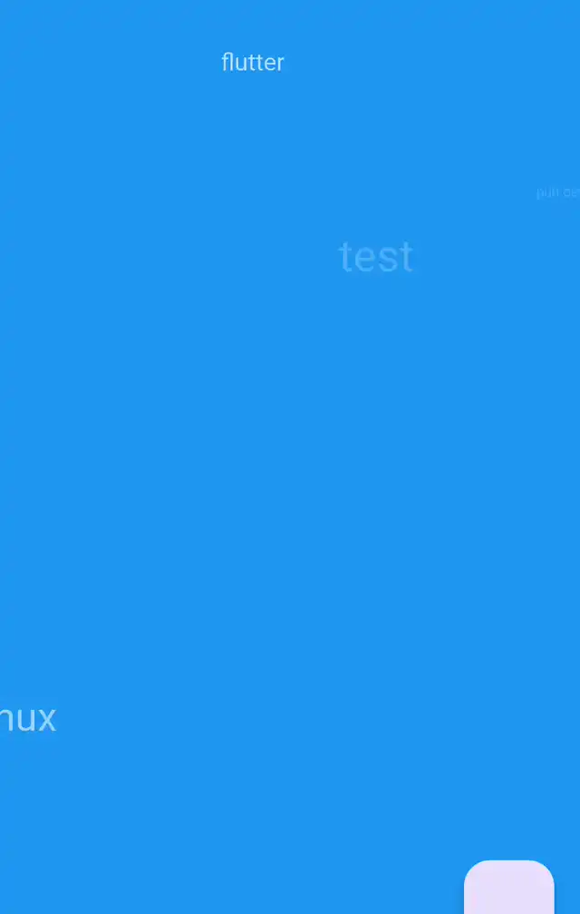

# Raindrop Fade Animation
Animates texts and images, as if they were raindrops on a body of water.

## Features

Animate images:


Animate texts:



## Getting started

Install the package using:
```
flutter pub add raindrop_fade_animation <newest version>
```

Or add it manually to your project's pubspec.yaml file.
No further dependencies neccessary.

## Examples

<!-- #code ./example/lib/main.dart -->
```dart
final multipleTexts = RaindropFadeAnimation.texts(
  texts: ['test', 'flutter', 'linux', 'pub.dev'],
  backgroundColor: Colors.blue,
  maxAnimationCount: 5,
  duration: Duration(milliseconds: 1500),
  particleSize: Size(200, 200),
  textStyle: TextStyle(fontSize: 28, color: Colors.white),);

final multipleImages = RaindropFadeAnimation.images(
  imageProviders: [AssetImage('assets/flutter.png'), AssetImage('assets/tux.png'),],
  backgroundColor: Colors.blue,
  maxAnimationCount: 5,
  duration: Duration(milliseconds: 1500),
  particleSize: Size(200, 200),);
```
## Trademarks

The Flutter name and logo are trademarks of Google LLC. Tux (the penguin) was created by Larry Ewing. This package is not endorsed by or affiliated with Google LLC. Logos are used for demonstration purposes only.

## License

MIT - see the [LICENSE](LICENSE) file for details.
